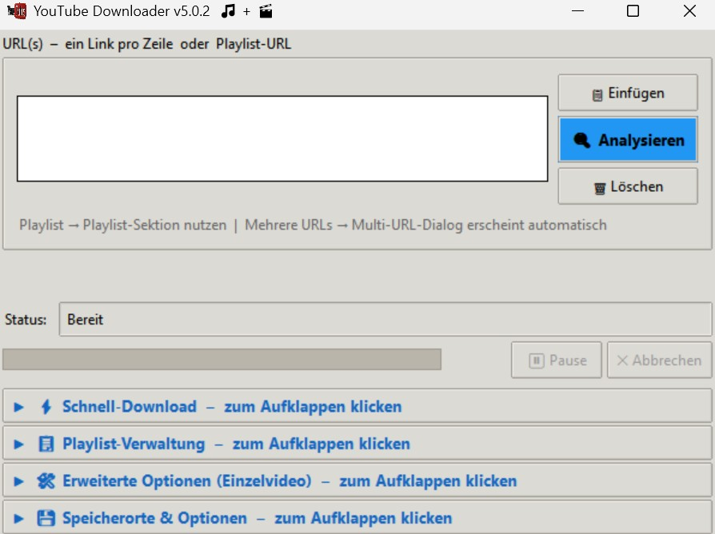
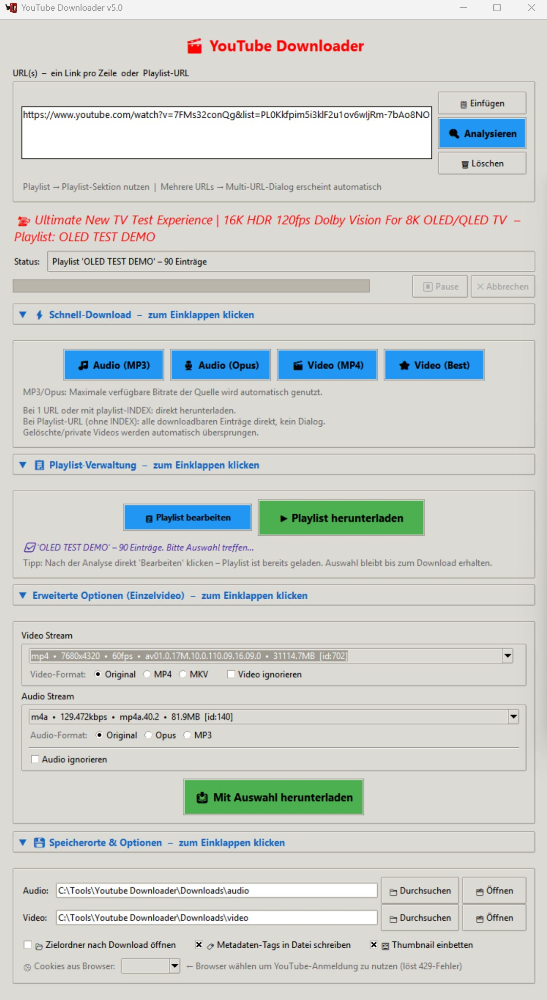
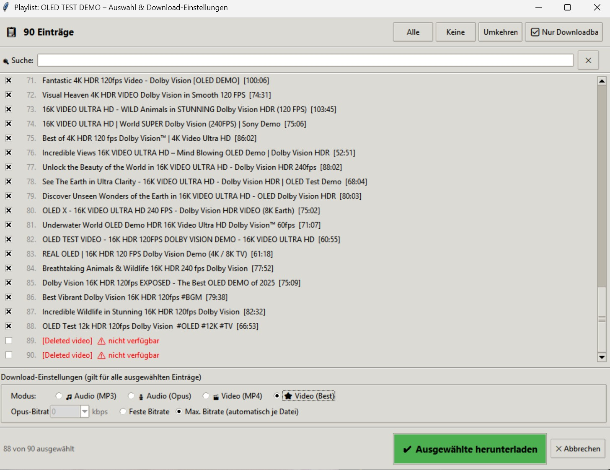

# YouTube Downloader GUI v5.0

Eine benutzerfreundliche grafische Oberfläche zum Herunterladen von Audio und Video aus YouTube-Links – mit modernem Design, Playlist-Support, Cover-Einbettung und flexibler Stream-Auswahl.

<p align="center">
  
</p>

<div style="display: flex; justify-content: center; gap: 10px;">
  
  
</div>

---

## Features

- **Audio-Download** als MP3 (inkl. wählbarer Bitrate) oder Opus
- **Video-Download** als MP4 oder in maximaler Qualität
- **Multi-URL** – mehrere Links auf einmal verarbeiten
- **Playlist-Support** – komplette Playlists oder einzelne Einträge herunterladen
- **Cover / Thumbnails** – werden automatisch als JPEG eingebettet (platzsparend, ~30–50 KB)
- **Tags** – Metadaten werden automatisch in die Datei geschrieben
- **Stream-Analyse** – alle verfügbaren Audio-/Videostreams eines Videos anzeigen und gezielt auswählen
- **Custom-Download** – freie Kombination aus beliebigem Video- und Audiostream
- **Einstellungen** werden automatisch gespeichert (Speicherpfade, Format, Bitrate, Browser …)
- **Cookie-Import** aus dem Browser – reduziert Bot-Erkennung durch YouTube
- **Pause / Abbrechen** während laufender Downloads

---

## Installation

### Voraussetzungen

- Python 3.10 oder neuer → [python.org](https://www.python.org/)  
  *(Beim Installieren: „Add Python to PATH" aktivieren)*
- Für Cookie-Import aus dem Browser: **Node.js** → [nodejs.org](https://nodejs.org)

### Python-Bibliotheken

#### Windows

```
pip install mutagen static-ffmpeg "yt-dlp[default]"
```

| Paket | Zweck |
|---|---|
| `yt-dlp[default]` | Download & Stream-Analyse |
| `static-ffmpeg` | Stellt FFmpeg & ffprobe automatisch bereit (kein manuelles Installieren nötig) |
| `mutagen` | Tags & Cover platzsparend in Audio-Dateien schreiben |

> **Hinweis zu FFmpeg (Windows):** Wird beim ersten Programmstart automatisch heruntergeladen und lokal gecacht. Keine manuelle Installation erforderlich.

#### Linux / macOS

Einmaliger Setup – Systempakete und Python-Bibliotheken:

```bash
# Ubuntu/Debian
sudo apt install -y ffmpeg python3-tk nodejs

# macOS (Homebrew)
brew install ffmpeg python-tk node

# Python-Pakete (kein static-ffmpeg nötig)
pip install "yt-dlp[default]" mutagen
```

> **Hinweis zu `static-ffmpeg`:** Unter Linux/macOS wird `static-ffmpeg` nicht benötigt und kann weggelassen werden. Das Skript erkennt das automatisch.

### Automatisches Update-Skript (Windows)

Das mitgelieferte `update_bibs.bat` prüft alle Abhängigkeiten und aktualisiert sie bei Bedarf per Doppelklick.

---

## Cookie-Import (empfohlen)

Um Bot-Erkennung durch YouTube zu reduzieren, kann die GUI Cookies direkt aus einem installierten Browser auslesen.

1. Im Browser (z.B. Firefox oder Chrome) bei YouTube einloggen
2. In der GUI unter **Speicherorte & Optionen** → ganz unten den gewünschten Browser auswählen

---

## Starten

```
python yt_downloader_gui.py
```

Oder doppelklick auf die Datei.

---

## Fehlerbehebung

| Problem | Lösung |
|---|---|
| `No module named tkinter` | `sudo apt install python3-tk` |
| `ffmpeg: command not found` | `sudo apt install ffmpeg` |
| `ModuleNotFoundError: yt_dlp` | `pip install yt-dlp` |
| 429-Fehler / Age-Gate | Cookies-Browser in den Einstellungen wählen |
| Ordner öffnet sich nicht | `sudo apt install xdg-utils` |

---

## Lizenz

MIT
