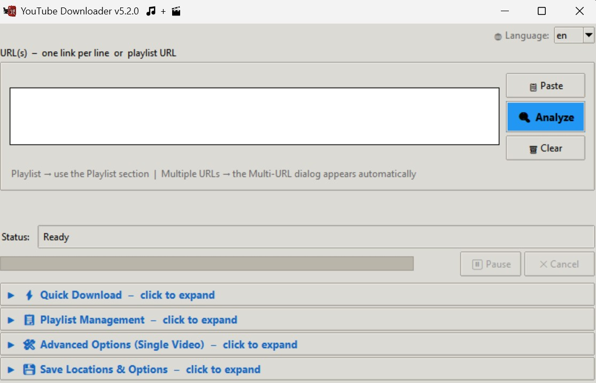
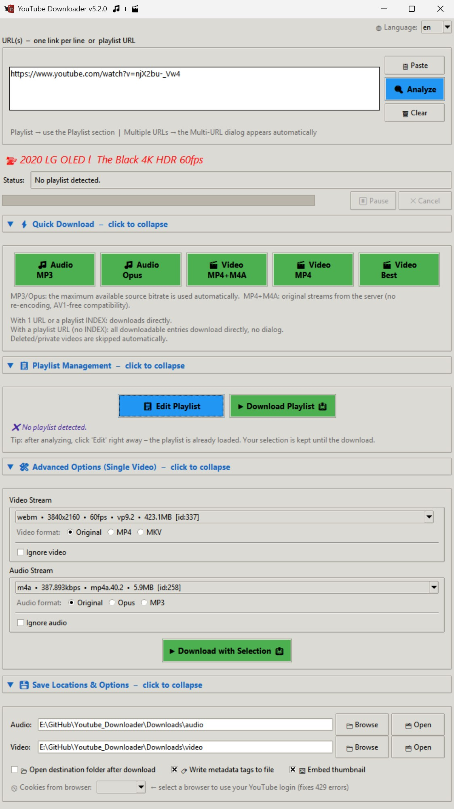
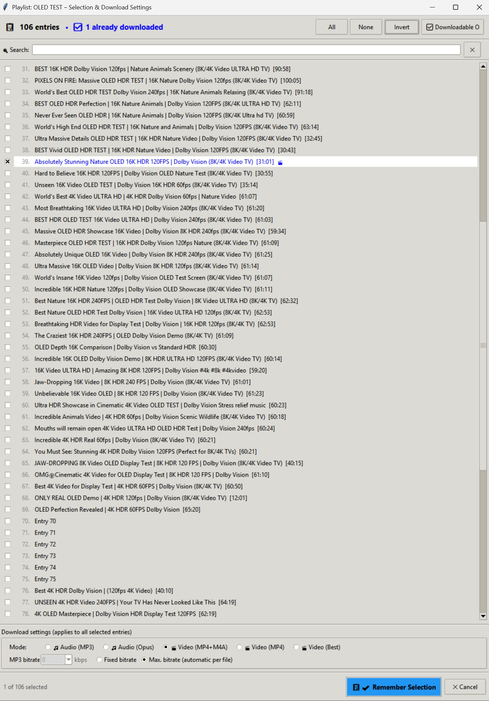

# YouTube Downloader GUI v5.2

A user-friendly graphical interface for downloading audio and video from YouTube links – with a modern design, playlist support, cover-art embedding, and flexible stream selection.

<p align="center">
  
</p>

<div style="display: flex; justify-content: center; gap: 10px;">
  
  
</div>

---

## Features

- **Multi-language UI** – English (default), German, and Farsi/Persian, switchable live from the main window (persisted to `yt_d_config.txt`)
- **Audio download** as MP3 (with selectable bitrate) or Opus
- **Video download** as MP4 or in maximum quality
- **Multi-URL** – process several links at once
- **Playlist support** – download entire playlists or individual entries
- **Cover / thumbnails** – embedded automatically as JPEG (space-saving, ~30–50 KB)
- **Tags** – metadata is written to the file automatically
- **Stream analysis** – view and select from all available audio/video streams of a video
- **Custom download** – freely combine any video and audio stream
- **Settings** are saved automatically (save paths, format, bitrate, browser, language …)
- **Cookie import** from the browser – reduces bot detection by YouTube
- **Pause / Cancel** for running downloads

---

## Installation

### Requirements

- Python 3.10 or newer → [python.org](https://www.python.org/)
  *(When installing: enable "Add Python to PATH")*
- For cookie import from the browser: **Node.js** → [nodejs.org](https://nodejs.org)

### Python libraries

#### Windows

```
pip install mutagen static-ffmpeg "yt-dlp[default]"
```

| Package | Purpose |
|---|---|
| `yt-dlp[default]` | Download & stream analysis |
| `static-ffmpeg` | Provides FFmpeg & ffprobe automatically (no manual install needed) |
| `mutagen` | Writes tags & cover art into audio files space-efficiently |

> **Note on FFmpeg (Windows):** Downloaded automatically and cached locally on first program start. No manual installation required.

#### Linux / macOS

One-time setup – system packages and Python libraries:

```bash
# Ubuntu/Debian
sudo apt install -y ffmpeg python3-tk nodejs

# macOS (Homebrew)
brew install ffmpeg python-tk node

# Python packages (static-ffmpeg not needed)
pip install "yt-dlp[default]" mutagen
```

> **Note on `static-ffmpeg`:** Not needed on Linux/macOS and can be omitted. The script detects this automatically.

### Automatic update script

- **Windows:** `update_bibs_windows.bat` – double-click to check and update all dependencies.
- **Linux/macOS:** `update_bibs_linux_macOS.sh` – run via `./update_bibs_linux_macOS.sh` (see note below).

---

## Cookie import (recommended)

To reduce bot detection by YouTube, the GUI can read cookies directly from an installed browser.

1. Log in to YouTube in your browser (e.g. Firefox or Chrome)
2. In the GUI, under **Save Locations & Options** → select the desired browser at the bottom

---

## Starting the app

```
python yt_downloader_gui.py
```

Or double-click the file.

---

## Troubleshooting

| Problem | Solution |
|---|---|
| `No module named tkinter` | `sudo apt install python3-tk` |
| `ffmpeg: command not found` | `sudo apt install ffmpeg` |
| `ModuleNotFoundError: yt_dlp` | `pip install yt-dlp` |
| 429 error / age gate | Select a cookies browser in the settings |
| Folder doesn't open | `sudo apt install xdg-utils` |

---

## License

This project is licensed under a custom non-commercial license - see
[LICENSE](LICENSE). Non-commercial use, copying and modification are
permitted; commercial use requires prior written permission from the
author.

**Disclaimer:** This software is provided "as is". No liability is
accepted for data loss or security incidents. Use at your own risk.
